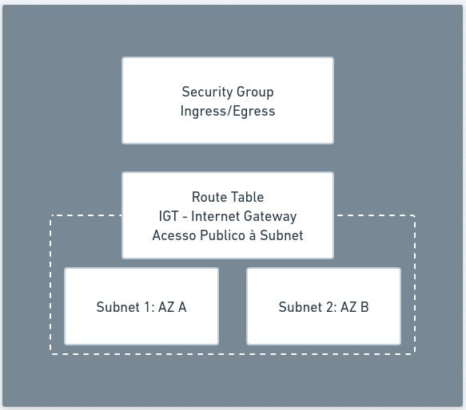
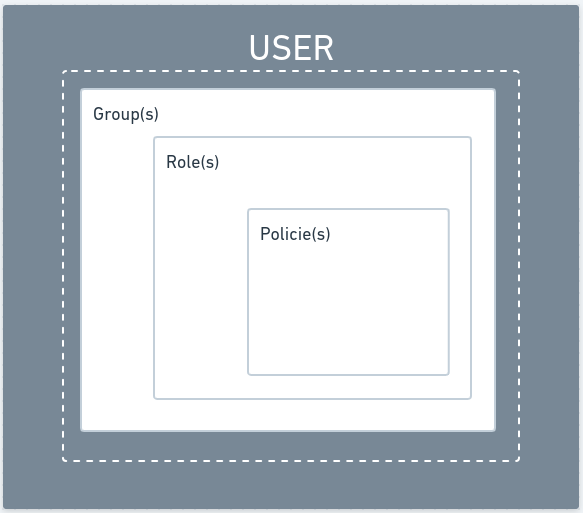

### VPC - Virtual Private Cloud



### Passo a Passo
- Criar novo Usuário (AdministratorAccess)

### Configurar AWS CLI
https://aws.amazon.com/pt/cli/

```bash
> aws configure
AWS Access Key ID [****************MPLE]: ***
AWS Secret Access Key [****************EKEY]: ***
Default region name [us-east-1]: 
Default output format [json]: 
```

```bash
> cat ~/.aws/credentials
[default]
aws_access_key_id = AKIAY************7NCZ
aws_secret_access_key = d6rFxgr2*******************xPev9
```

### Criando VPC
https://registry.terraform.io/providers/hashicorp/aws/latest

```terraform
terraform {
  required_version = ">=0.13.1"
  required_providers {
    aws   = ">=3.54.0"
    local = ">=2.1.0"
  }
}

provider "aws" {
  region = "us-east-1"
}
```

```bash
> terraform init
```

```bash
> terraform plan

Terraform used the selected providers to generate the following execution plan. Resource actions are indicated
with the following symbols:
  + create

Terraform will perform the following actions:

  # aws_vpc.new-vpc will be created
  + resource "aws_vpc" "new-vpc" {
      + arn                                  = (known after apply)
      + cidr_block                           = "10.0.0.0/16"
      + default_network_acl_id               = (known after apply)
      + default_route_table_id               = (known after apply)
      + default_security_group_id            = (known after apply)
      + dhcp_options_id                      = (known after apply)
      + enable_classiclink                   = (known after apply)
      + enable_classiclink_dns_support       = (known after apply)
      + enable_dns_hostnames                 = (known after apply)
      + enable_dns_support                   = true
      + enable_network_address_usage_metrics = (known after apply)
      + id                                   = (known after apply)
      + instance_tenancy                     = "default"
      + ipv6_association_id                  = (known after apply)
      + ipv6_cidr_block                      = (known after apply)
      + ipv6_cidr_block_network_border_group = (known after apply)
      + main_route_table_id                  = (known after apply)
      + owner_id                             = (known after apply)
      + tags                                 = {
          + "Name" = "fullcycle-vpc"
        }
      + tags_all                             = {
          + "Name" = "fullcycle-vpc"
        }
    }

Plan: 1 to add, 0 to change, 0 to destroy.
```

### IAM


### Criando Kubeconfig para acessar o Cluster
[./5-outputs.tf](./5-outputs.tf)

### Instalando aws-iam-authenticator
[Installing aws-iam-authenticator](https://docs.aws.amazon.com/eks/latest/userguide/install-aws-iam-authenticator.html)